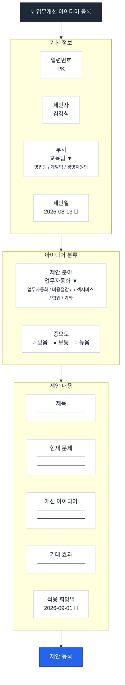

## 🔗 단축링크
```
https://m.site.naver.com/2eeF2
```
---
## 📱 입력화면 구성

---

## 🎨 색상표
| 구성 요소    | 배경색         | 폰트색         | 테두리색        |
| -------- | ----------- | ----------- | ----------- |
| 전체 화면    | `#FFF5F7FA` |  |  |
| 타이틀      | `#FF1F2937` | `#FFFFFFFF` |  |
| 섹션 제목    | `#FFEAF2FF` | `#FF2563EB` | `#FFC7D9F5` |
| 라벨       | `#FFF8FAFC` | `#FF334155` | `#FFCBD5E1` |
| 글자 입력란   | `#FFFFFFFF` | `#FF1E293B` | `#FFCBD5E1` |
| 기본 버튼    | `#FF2563EB` | `#FFFFFFFF` | `#FF1D4ED8` |
---

### 🖼️ 패킹용 이미지
- [메인화면 & 앱 아이콘 이미지](https://github.com/simeddk/SharedRepository/raw/refs/heads/main/%EC%9E%85%EB%AC%B8%EA%B5%90%EC%9C%A1%EA%B3%BC%EC%A0%95/Images.zip)
---
## 🌐 API 연습
- API 연습용 사이트들!
- https://github.com/public-api-lists/public-api-lists
- https://github.com/tools-collection/apis-collection
- https://free-apis.github.io/
- 실제로 해볼 곳! https://dog.ceo/dog-api/
---
## 🎞️ API 활용
#### [EndPoint]
https://ax-video-orchestrator.duckdns.org/jobs
- 스마트메이커에서는 `/` 글자를 기반으로 주소를 2개로 나눠야 합니다!
- 서비스경로
```
ax-video-orchestrator.duckdns.org
```
- 서비스기능
```
/jobs
```

#### [Content-Type]
```
application/json
```

#### [Header]
- Name
```
X-API-Key
```
- Value
```
fa25...XXX..지금은 비밀!
```

#### [Request]
```json
{
	"prompt":"석양지는 해변가에서 뛰어노는 40대 아빠와 6살 아들",
	"provider":"veo"
}
```

#### [Response]
```json
{
	"job_id":"job_XXXXXXOOOOOO",
	"status":"queued"
}
```

#### 실행 결과 보는 곳
https://ax-video-orchestrator.duckdns.org/docs
