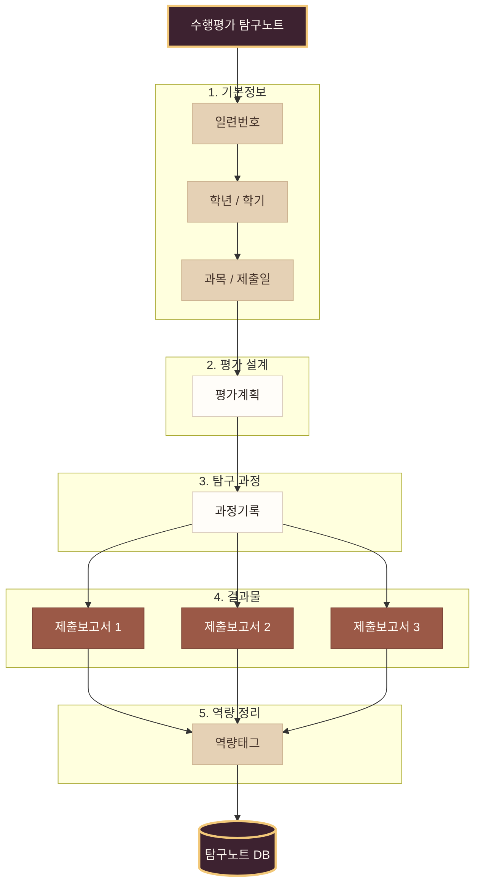

# 단축 URL
https://m.site.naver.com/2cGJJ

## 📱앱 정보

## 🎨 섹상 테이블

| 구성 요소   |       배경색 |       폰트색 |      테두리색 |
| ------- | --------: | --------: | --------: |
| 전체 화면             | `#FFF5EFE6` | `#FF2C2521` |        투명 |
| 타이틀                | `#FF3D2230` | `#FFFFF9F2` | `#FF3D2230` |
| 라벨                  | `#FFE5D1B5` | `#FF49372D` | `#FFCDB492` |
| 글자 입력란                | `#FFFFFDF9` | `#FF2C2521` | `#FFD9CBBB` |
| 이미지 입력란         | `#FFFBF6EE` | `#FF695C52` | `#FFD4C3AE` |
| 기본 버튼             | `#FF9B5947` | `#FFFFF9F2` | `#FF7D4437` |
| X 버튼             | 투명 | `#FFF2C879` | 투명 |

## 🖼️ 에셋들
- [⬇ 버튼 이미지](https://github.com/simeddk/SharedRepository/raw/refs/heads/main/%EC%A4%91%EB%93%B1%EC%A7%84%EB%A1%9C%EC%B2%B4%ED%97%98/%EB%B2%84%ED%8A%BC%20%EC%9D%B4%EB%AF%B8%EC%A7%80.zip)
- [⬇ 수행평가/탐구보고서 예](https://github.com/simeddk/SharedRepository/raw/refs/heads/main/%EC%A4%91%EB%93%B1%EC%A7%84%EB%A1%9C%EC%B2%B4%ED%97%98/%EB%B3%B4%EA%B3%A0%EC%84%9C%20%EC%98%88%EC%8B%9C.zip)
